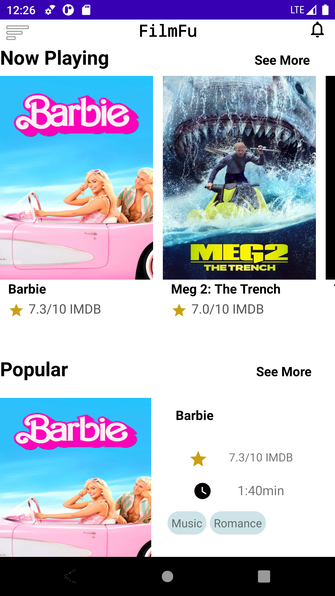
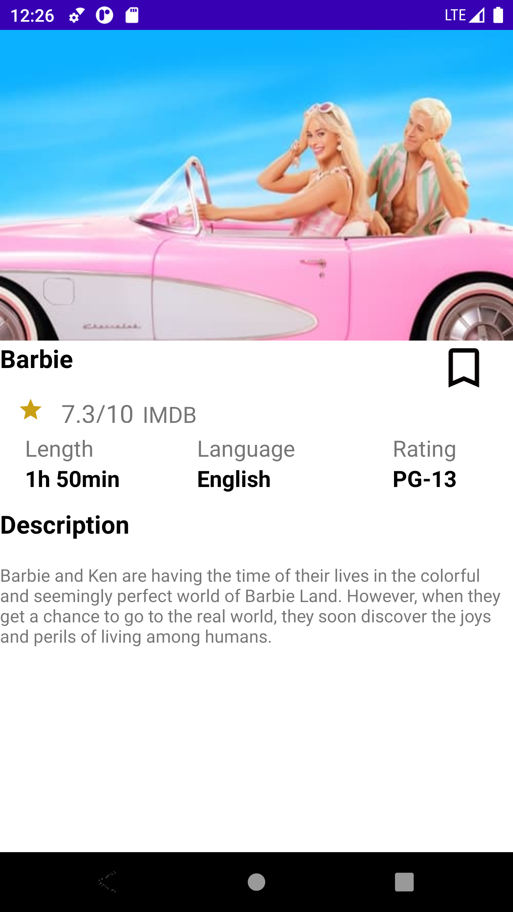

# Movie App

Movie App is an Android application built with Kotlin that lets users browse and bookmark their favorite movies. The app fetches movie data from the MovieDB API and displays now showing movies and popular movies on the home page. Users can click on any movie to view its details and add it to their bookmarks.

The app uses Room and SQLite database to store bookmarked movie information. Users can navigate to the bookmarks page using the navigation drawer from the homepage, where all the bookmarked movies are shown. Users can also delete any bookmarked movie by clicking on the delete button.

## Architecture and Libraries

The app uses the MVVM (Model-View-ViewModel) architecture pattern to structure the code. This pattern separates the app into three components: the view (UI), the viewmodel (business logic), and the model (data). This separation allows for better testing and maintainability.

The app also uses dependency injection using the Hilt library. Hilt is a library that reduces the creation of unnecessary instances of classes, making the app more efficient and easier to maintain.

## Installation

To install and run the app on your Android device, follow these steps:

1. Clone the repository
2. Open the project in Android Studio
3. Build the project and install it on your device

Alternatively, you can download the APK file from the releases page and install it directly on your device.

## Usage

When you open the app, you will be taken to the home page, where you can see the now showing and popular movies. Click on any movie to view its details and add it to your bookmarks.

To view your bookmarks, open the navigation drawer and select "Bookmarks". Here you can see all your bookmarked movies and delete any of them if needed.

## Contributing

If you want to contribute to this project, feel free to submit a pull request or report any issues on the GitHub repository page.

## Acknowledgements

The app uses the MovieDB API to fetch movie data. Special thanks to them for providing such a great API.

## Contact

If you have any questions or feedback, feel free to reach out to me at [nahianpathan12@gmail.com]. Thanks for using Movie App!
